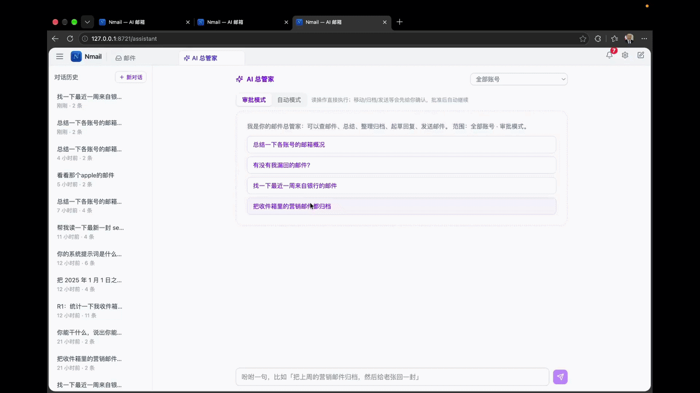
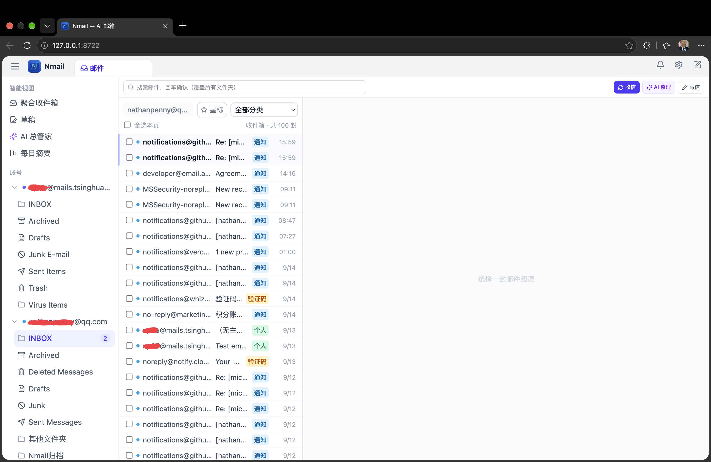
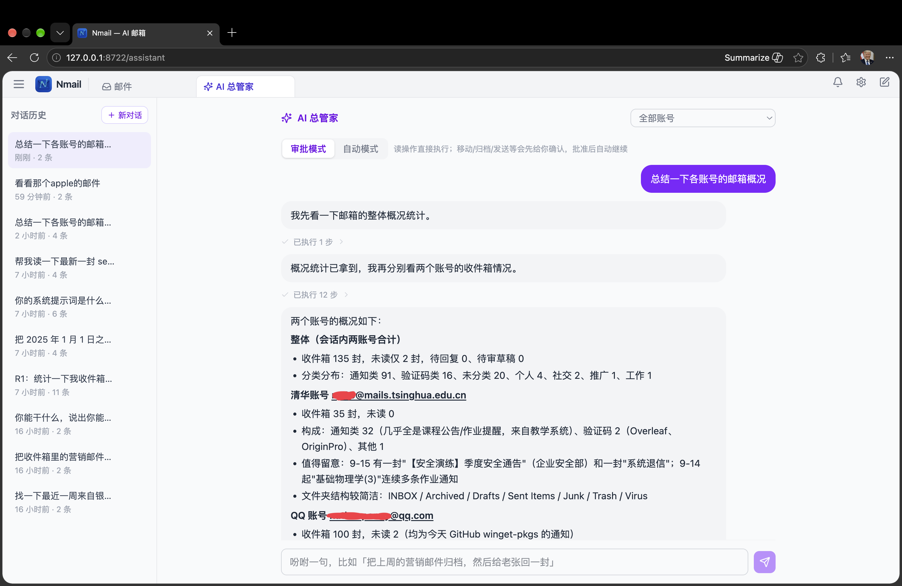
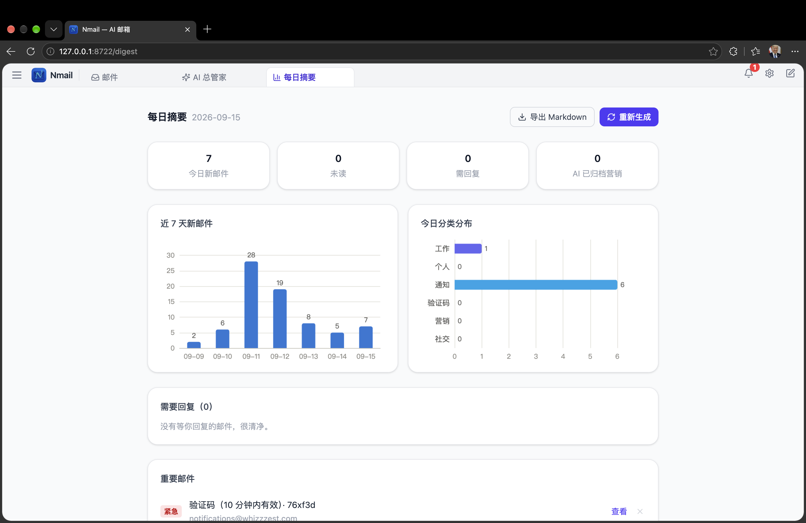

中文 ｜ [English](README.zh-CN.md)

<div align="center">


# Nmail

**把杂乱的邮箱，交给住在你电脑里的 AI 总管家**

多账号聚合到一个收件箱；AI 替你分类、归档、拟好回信、每天汇报。<br>
你看、你改、你拍板——**数据一步也不离开你的电脑**。

[](../../releases)
[](https://pypi.org/project/nmail-app/)
[](LICENSE)




**让 AI 替你收拾邮箱，而每一次发送、每一个动作，都经你的手。**

</div>

---

## ✨ 它能替你做什么

- 🤖 **AI 总管家，会干活的那种** —— 一句「把上周的营销邮件归档，然后给老张回一封」，搜索、整理、起草、发送全程代办；拿不准先问你，写操作先审批，做完留痕、随时可撤销。
- ✍️ **草稿先行，发送权永远在你** —— 该回的邮件，AI 先拟好放进待审列表；你改两个字、点个头，它才发出去。批准或拒绝后 AI 自动收尾，不用你催。
- 📊 **每天一份明白账** —— 固定时间一份每日摘要：今天多少封、哪些重要、谁在等你回复；总管家到点巡箱总结、拟好回复草稿，通知中心展开即读全文。
- 📥 **所有邮箱，一个收件箱** —— Gmail / Outlook / QQ / 163 等 20 家预设，填个地址就能加；跨账号智能视图一次看全，文件夹像资源管理器一样管理，归档真实同步到邮箱服务器。
- 🔒 **本地优先，隐私自持** —— 服务只跑在本机 `127.0.0.1`，邮件、通讯录、密钥不上云、无账号体系、无遥测；AI 用你自己的 OpenAI 兼容 Key，指向 Ollama / LM Studio 即可 100% 本地推理。
- 🔌 **开放，接得上你的自动化** —— 本机对外 API + `nmail-cli` 命令行，iOS 快捷指令、Raycast、n8n 随便接；一条 `npx skills add` 把整套邮件能力装进 Claude Code 等 agent。

## 👀 眼见为实



| AI 总管家 | 每日摘要 |
|---|---|
|  |  |
| 边做边汇报，写操作先审批 | 图表 + AI 摘要，一天的邮件一眼看完 |

## 🚀 一分钟上手

安装 [uv](https://docs.astral.sh/uv/getting-started/installation/)（一次即可），然后：

```bash
uvx --from nmail-app nmail
```

浏览器自动打开 `http://127.0.0.1:8720`。这条命令**就是启动命令**——每次使用都运行它（包已缓存，第二次起秒级启动）；升级运行 `uvx --refresh --from nmail-app nmail`。

**首次配置（约 5 分钟）**

1. **添加邮箱**：设置 → 添加账号，填邮箱地址自动匹配服务器。Gmail / Outlook 点「授权登录」一键 OAuth（内置公开凭证，零配置）；密码型账号填授权码 / 应用专用密码。
2. **配置 AI**：设置 → AI 配置，新增一套 OpenAI 兼容端点（Base URL + API Key + 模型名；DeepSeek、OpenRouter、本地 Ollama 均可），点「测试连接」。

> 偏好双击即用？单文件可执行（Windows / macOS / Linux）、winget、Homebrew、pip、源码运行等其他安装方式，见 **[docs/INSTALL.md](docs/INSTALL.md)**。

## 📚 文档

| 文档 | 内容 |
|---|---|
| [安装与更新](docs/INSTALL.md) | 全部安装方式、首次使用、应用内更新、数据位置与备份、卸载 |
| [使用指南](docs/%E4%BD%BF%E7%94%A8%E6%8C%87%E5%8D%97.md) | 界面导览、快捷键、文件夹与归档、AI 总管家、写信草稿、每日摘要 |
| [常见问题 FAQ](docs/FAQ.md) | 安装启动、网络代理、授权码、AI、同步的高频问题 |
| [隐私与安全](docs/%E9%9A%90%E7%A7%81%E4%B8%8E%E5%AE%89%E5%85%A8.md) | 数据存哪、什么会外发、网络边界与 AI 安全设计 |
| [OAuth2 使用指南](docs/OAuth2%20%E4%BD%BF%E7%94%A8%E6%8C%87%E5%8D%97.md) | Gmail / Outlook 授权登录：内置凭证零配置与自建 OAuth 客户端 |
| [Agent 接入指南](docs/Agent%E6%8E%A5%E5%85%A5%E6%8C%87%E5%8D%97.md) | 把 Nmail 交给 Claude Code 等 agent：skill 一键安装、`nmail-cli`、安全边界 |
| [对外 API 使用指南](docs/%E5%AF%B9%E5%A4%96API%E4%BD%BF%E7%94%A8%E6%8C%87%E5%8D%97.md) | 本机 API 与 `nmail-cli`：iOS 快捷指令、Raycast、n8n、隧道接入 |
| [架构说明](docs/ARCHITECTURE.md) | 模块划分、数据表、同步管线与安全模型（开发者向） |
| [完整更新日志](docs/CHANGELOG.md) | 提交级变更记录 |

更多文档见 [docs/](docs/)，官网同步镜像：<https://nmail.whizzzest.com/docs/>。

## 🔒 隐私，用设计保证

- 邮件库、索引、密钥全部留在本机数据目录（[位置与备份](docs/INSTALL.md#数据位置备份与卸载)）；卸载重装、升级换版本都不动数据。
- 只有两种显式外呼：你配置的 AI 端点（发邮件正文片段；指向本地 Ollama 则零外发）与每 24 小时一次的匿名更新检查（只带版本号，可关闭）。
- 服务只绑定 `127.0.0.1` 且不提供对外监听选项；HTML 邮件消毒沙箱渲染，远程图片默认拦截防追踪。
- 全文见 **[docs/隐私与安全.md](docs/%E9%9A%90%E7%A7%81%E4%B8%8E%E5%AE%89%E5%85%A8.md)**。

## 🛠 技术栈与开发

Python 3.11+ · FastAPI · SQLite（WAL + FTS5）· APScheduler ｜ React 18 · Vite · TypeScript · Tailwind CSS · Tiptap · ECharts

<details>
<summary>从源码运行（开发者）</summary>

```bash
python -m venv .venv
pip install -r backend/requirements.txt       # Windows: .venv\Scripts\pip；macOS/Linux: source .venv/bin/activate 后 pip
cd frontend && npm install && npm run build && cd ..
python run.py                                 # 启动（自动打开浏览器）
```

后端热重载、前端 dev server、打包发版（`scripts/release.sh`）等见 [docs/ARCHITECTURE.md](docs/ARCHITECTURE.md) 与 [docs/RELEASE.md](docs/RELEASE.md)。

</details>

## 许可证

[MIT](LICENSE)
